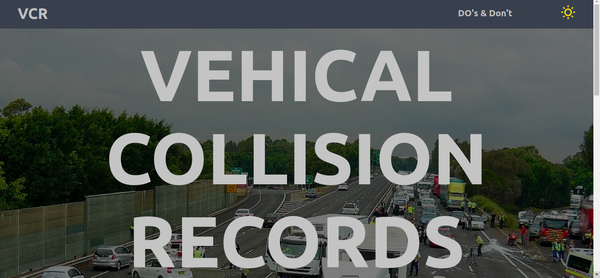

# Vehical Collision Records

 

<!---  -->

This is the project that I developed,has given as a task by Ipsator. I have tried my best to put all the things which is mentioned in the given pdf and adhere to the web dev discipline which is performence, accessbility and best practices to make it better.

# Table of Contents

- [Installation](#installation)
- [Libery Used](#libery-used)
- [File Structure](#file-structure)

## Installation

- git clone **https://github.com/info-vivekranjan/CarCrash.git**
- npm install
- npm start

## Libery Used

- React
- React Router Dom
- Axios

## File Structure

Within the download you'll find the following directories and files:

```
CarCrash
|
│   README.md
|
└───src
│   |  Components───|
│   |  Context      |CarCrash.jsx
|   |  App.js       |CarCrashDetails.jsx
│   |               |Navbar.jsx
│                   |Routes.jsx
                    |Css
                    |Img

```

## Glimpses of my work!

- Landing Page
  

- List Layout
  

- Grid Layout
  

- Crash Details
  
